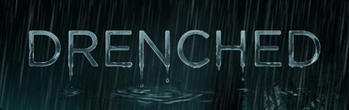

# Dark & Stormy Night — Atmospheric Environment Engine



An interactive, modular atmospheric engine built with plain HTML, CSS, and modern JavaScript. Switch between weather intensities, typographic profiles, and thematic styles — visual layers and synthesized audio assets respond in perfect synchronization via a centralized timeline controller.

No frameworks. No build tools. Completely vanilla.

---

## 🌟 Architectural Features

- **Unified Master Scene Director** — An orchestrating controller class handles weather simulation clocks and triggers synchronized cross-system timeline events.
- **Data-Driven Asset Architecture** — A centralized asset blueprint manifest drives audio, mirroring professional game engine workflows with string-key invocations.
- **Procedurally Synthesized Audio** — Continuous rain noise, multi-layered rolling thunder, and high-pass UI snap feedback generated at runtime via the Web Audio API. Zero external sound files.
- **Synchronized Power-Grid Surges** — Dynamic CSS lightning screen flashes are structurally tied to typographic font brightness and shadow filter flickers.
- **Cinematic Atmosphere** — Parallax fog drift, CRT retro scanlines, radial vignette, and an interactive noise-tile canvas rendering live film grain.
- **Responsive Controls** — Auto-hiding control panel HUD with matching cursor suppression that adapts fluidly to desktop or mobile layouts.

---

## 📂 Project Structure

```text
Rain/
│ 
├── index.html                  — Document scaffolding & centralized HUD container elements
│ 
├── css/
│   └── style.css               — Global design canvas, layer stack coordinates, & screen transitions
│ 
├── js/
│   ├── Config.js                — Intensity delays, color arrays, & audio envelope baseline values
│   ├── AudioManager.js          — Low-level mixer graph, node pools, & data-driven asset player
│   ├── EnvironmentController.js — Master Scene Director, time management loops, & event timeline sync
│   ├── RainVisuals.js           — Screen painting, DOM mutation, canvas grain, & color mapping
│   ├── TextDisplay.js           — Typographic layout states & hero text flash transitions
│   ├── Hud.js                   — Control interface panel binder, slider logic, & auto-hide timing
│   ├── Engine.js                — Top-level modular system bootloader and dependency injection
│   └── Main.js                  — Application lifecycle entry point (fires Engine on DOM load)
│ 
└── images/
```

---

## 🛠️ Setup

1. Clone or download the repository template.
2. Verify that your directory structure matches the file tree above.
3. Open `index.html` natively inside any modern browser.

No installation steps, server processes, or dependency setups required.

---

## 🎛️ Interactive Controls

| Control Group | Active Functional Targets |
|---|---|
| **Text Color** | Dynamic palette shifting (Red, Green, Blue) with synchronized glow boundaries |
| **Rain Intensity** | Weather clock indexing (Rain, Storm, Torrent) driving timing and volumes |
| **Text Mode** | Layout rendering profiles (Static Hero Frame vs Continuous Scroll Marquee) |
| **Volume Configuration** | Hardware mute toggle and live master logarithmic sound gain manipulation slider |

The HUD panel and system cursor automatically fade out after 3 seconds of user inactivity. Move the mouse, slide an interface item, or tap the viewport boundary to restore visibility instantly.

---

## ⚡ How the Synthesized Engine Works

Everything is mathematically formulated and synthesized directly inside your computer's audio card — completely free of disk read overhead.

- **Persistent Environment Audio** — A dedicated white-noise generator is bound directly into an active Web Audio `BandpassFilterNode`, smoothly modulated across a continuous volume gain timeline.
- **The Orchestrated Strike Timeline** — When the master environmental scheduling clock fires an event, a single multi-system timeline coordinates three operations at the exact same millisecond:
  1. **Visual Overlay**: An instantaneous linear transition flash spikes the opacity of the screen overlay.
  2. **Typographic Surge**: Font filters are overdriven to boost brightness and text shadows, mimicking electrical hardware stress.
  3. **Acoustic Wave Distribution**: The software schedules a high-gain procedural crack burst, followed immediately by multiple stacked, time-shifted low-frequency acoustic sweeps running through `LowshelfFilter` and `LowpassFilter` structures to mimic moving shockwaves.

---

## 🛠️ Technology Stack

- **HTML5** (Semantics, Canvas Context APIs)
- **CSS3 Core** (Custom variable inheritance, procedural animations, hardware-accelerated layouts)
- **Vanilla ES6+ JavaScript** (Web Audio API, Node Pooling, Canvas Render Loops, requestAnimationFrame)

---

## 🗺️ Engineering Roadmap

- [x] JS-driven lightning with unified timeline synchronization
- [x] Fully integrated master volume slider manipulation
- [x] Streamlined, data-driven file-like audio asset player architecture
- [ ] Wind gust procedural audio generator layer
- [ ] Direct keyboard layout short-keys for fast weather testing
- [ ] Fullscreen toggle macro hook
- [ ] Modular framework extensions for alternative biomes (Forest Canopy, Cyberpunk Metropolis, Deep Space)

---

## 📄 License

Open-source architecture. Free to clone, study, fork, modify, and repurpose for any non-commercial or commercial software installation.
